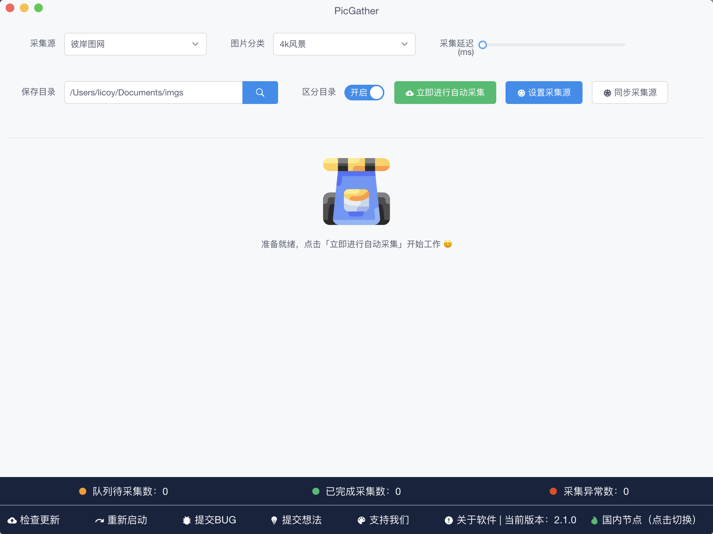
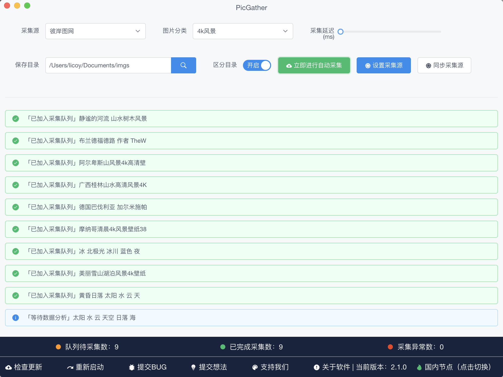
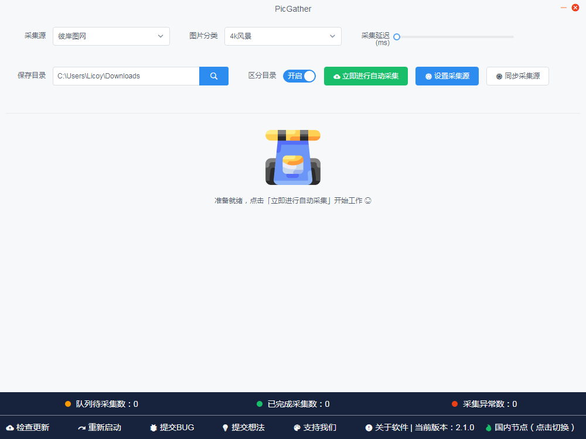
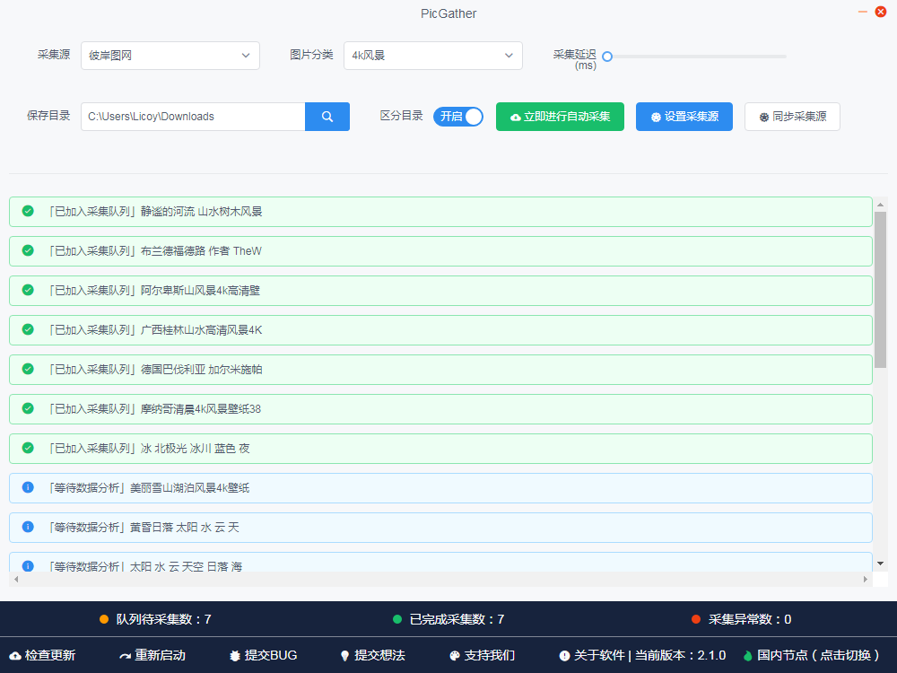
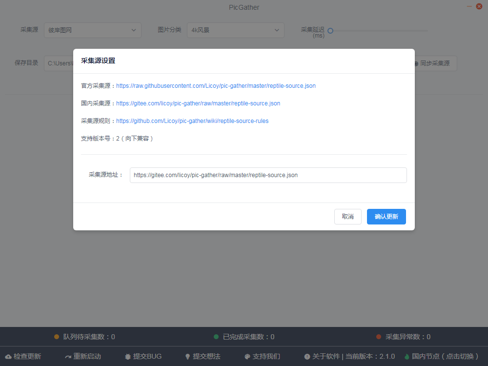

简体中文|[English](./README_EN.md)

    
    <h1>PicGather</h1>
    
基于electron-vue开发的个人图片收藏器，支持自定义收藏源站配置，兼容MacOS与Windows操作系统

      
        
      
      
    
    
    

## 应用介绍
PicGather是基于electron-vue开发的个人图片收藏器，支持自定义收藏源站配置，兼容MacOS与Windows操作系统
## 下载安装
您可以[点击此处](https://github.com/Licoy/pic-gather/releases)进行下载安装，支持Mac/Windows/Linux(未测试)
## 自定义收藏规则
- [收藏源规则文档](https://github.com/Licoy/pic-gather/wiki/star-rules)
## 使用截图（V2.1.0版本，请以最新版本为准）
### Mac

### Windows

## 使用说明
此项目仅供学习交流或个人使用，请勿使用于商业及非法用途，若违反使用条例请自行承担相关后果。
## 使用协议
- [使用协议](./USE_AGREEMENT.md)
## 资源说明
本程序所有资源均来自于互联网，若侵犯到您的权利，请提交issue我们将核对完成第一时间删除相关内容。
## 讨论
- QQ群：30261540  &nbsp; [点我加入QQ群讨论](https://shang.qq.com/wpa/qunwpa?idkey=c3541f1d0dbe443456228e3aebf23f6795b614a94d5df6a32f0b2b1c759bb99b)

- 作者博客：[https://www.licoy.cn](https://www.licoy.cn)

